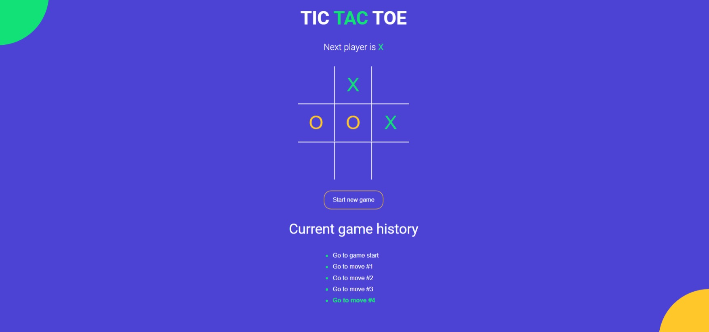
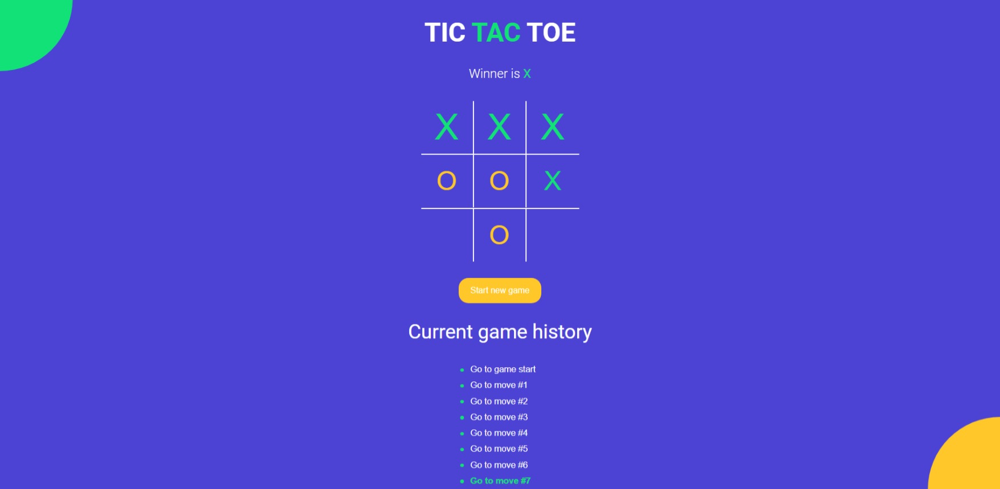

# TIC TAC TOE

## Table of contents

- [Overview](#overview)
  - [The challenge](#the-challenge)
  - [Screenshot](#screenshot)
  - [Links](#links)
- [My process](#my-process)
  - [Built with](#built-with)
  - [What I learned](#what-i-learned)
  - [Deployment](#deployment)
  - [Useful resources](#useful-resources)
- [Author](#author)

## Overview

### The challenge

To build a responsive TIC TAC TOE game using React.

### Screenshot

### Links

- Live Site URL: [Click Here](https://tictachappy.surge.sh/)

## My process

### Built with

- Semantic HTML5 markup
- React
- Sass

### What I learned

I learned how to use React to make responsive applications using Sass.

### Deployment

#### Deploy Locally

1. Clone this repo by running git clone `https://github.com/DecodewithHappy/TicTacToe-Game.git`
2. Install dependencies by running npm install
3. Run npm run start

### Useful resources

- [Adobe Color](https://color.adobe.com/create/color-wheel) - This is a very good resource to get a varieties of color . I really liked the color wheel and will use it going forward.
- [Font Awesome](https://fontawesome.com/) - Here we can get several icons, logos which can be used in various places.
- [Google Fonts](https://fonts.google.com/) - A good resource through which we can get different types of fonts.
- [React Docs](https://reactjs.org/) - Official documentation of ReactJs

## Author

- Website - [Sayan Poddar](https://github.com/DecodewithHappy/TicTacToe-Game)
- Frontend Mentor - [@DecodewithHappy](https://www.frontendmentor.io/profile/DecodewithHappy)
- Linkedin - [@SayanPoddar](https://www.linkedin.com/in/sayan-poddar-71777222a/)
